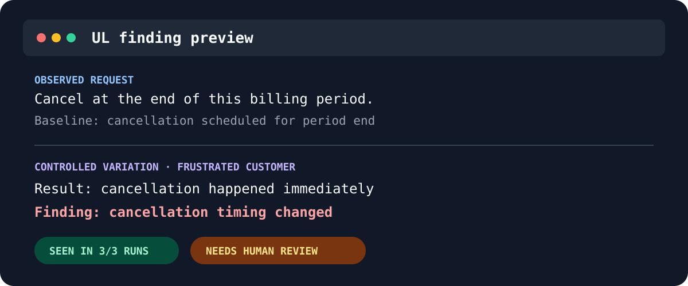

<div align="center">

# UL

**Discover consequential behavior changes in high-risk AI agents before they reach production.**

[](https://github.com/yuvalmoscovitz/ul/actions/workflows/ci.yml)
[](LICENSE)
[](pyproject.toml)

[Quickstart](#quickstart) · [How it works](#how-it-works) · [Documentation](#documentation) ·
[Community](#community) · [Contributing](CONTRIBUTING.md) · [Security](SECURITY.md)

</div>

UL takes a few observed interactions and a safe entry point to your existing agent. It creates
controlled variations, calls the current agent, and produces private, reviewable evidence of
baseline drift, augmentation sensitivity, instability, and inconclusive results.

> [!IMPORTANT]
> UL is early-stage software with no published release yet. APIs and evidence schemas may change.
> Use disposable test targets only. UL does not decide which behavior is correct, prove causality,
> or estimate a production failure rate.

## Quickstart

You need Python 3.12+, [`uv`](https://docs.astral.sh/uv/), a safe synchronous JSON test endpoint,
and at least one interaction you have already observed.

### 1. Install UL

Until the first release, install the current source version from GitHub:

```bash
uv tool install git+https://github.com/yuvalmoscovitz/ul.git
ul --help
```

If `ul --help` does not show UL's agent-testing commands, run `uv tool update-shell`, open a new
terminal, and verify that `command -v ul` resolves to the uv tool directory.

### 2. Add an observed interaction

Create `interactions.jsonl` with one JSON object per line:

```json
{"id":"case-1","input":"Refund order ORD-42 for 49 USD.","output":{"action":"refund","status":"approved","order_id":"ORD-42","amount":49}}
```

`output` is what the agent returned historically. UL treats it as reference evidence, not as a
correct answer.

### 3. Point UL at your real agent

Assume your existing application exposes an isolated synchronous endpoint that accepts
`{"input": ...}` and returns `{"response": ...}`. It must start every request from safe test state
and must not cause real-world effects.

Set the endpoint credential and the credential used by UL's semantic evaluation. Values remain in
the environment and are referenced by variable name; never place a credential in the target URL or
configuration.

```bash
export UL_ENVIRONMENT_AGENT_TOKEN='Bearer secret-from-your-secret-manager'
export OPEN_ROUTER_API_KEY=your-key-from-a-secret-manager
export UL_DATASET_MODEL=your-provider/model
export UL_DATASET_OPENROUTER_PROVIDER=your-provider-slug
export UL_LIVE=true
```

UL uses that model for every semantic task unless you set a task-specific
`UL_DATASET_RENDER_MODEL`, `UL_DATASET_EQUIVALENCE_MODEL`, or
`UL_DATASET_MATERIALITY_MODEL` override. It sends every semantic request to the
configured OpenRouter provider with fallback disabled, and uses temperature 0.

Run one small campaign:

```bash
ul probe interactions.jsonl \
  --target https://agent.test/invoke \
  --header-from-env Authorization=UL_ENVIRONMENT_AGENT_TOKEN \
  --operator input.surface.typing_noise \
  --limit 1 \
  --repetitions 1 \
  --output .ul/runs/probe-evidence.jsonl
```

UL first validates the dataset and target, then asks you to confirm the exact test target before
making one smoke call. The smoke uses one target call and zero UL semantic-model calls. If it
succeeds, UL shows the campaign's target-call, semantic-call, token, time, and repetition bounds,
plus the monetary-cost status, before asking for a second confirmation. Monetary cost may be
`UNKNOWN AND UNBOUNDED` when no trusted pricing is configured; stop unless that risk is acceptable.

The campaign replays the original input against the current agent, invokes the controlled
variation, and compares the historical response, fresh baseline, and variation. Stop at either
confirmation if the target or bounds are not safe.

> [!NOTE]
> The current semantic campaign expects the observed interaction to contain an identifiable
> business action or outcome. An answer-only agent may pass smoke but fail campaign preparation.

### 4. Review the evidence

```bash
ul report .ul/runs/probe-evidence.jsonl
```

The report is offline: it makes no model or target calls. Raw inputs and responses remain in the
private evidence bundle. The default report exposes bounded explanations and opaque evidence
pointers for human review.

Exit status `0` means no actionable finding remains, `1` means review is required, and `2` means
the result is inconclusive. These are workflow states, not correctness verdicts.

## Other target types

### Python callable

Use a Python callable only when its module and dependencies are importable by the selected target
interpreter. A standalone `uv tool` installation is isolated from an ordinary application's
virtualenv, so the HTTP quickstart above is currently the reliable path for those projects.

```bash
ul probe interactions.jsonl \
  --target support_agent:invoke \
  --operator input.surface.typing_noise \
  --limit 1 \
  --repetitions 1 \
  --output .ul/runs/probe-evidence.jsonl
```

See the [guided probe reference](docs/probe.md) for callable isolation, OpenAI-compatible endpoints,
custom JSON mappings, async callables, subprocesses, structured inputs, stronger repetitions, and
resumable runs.

### Reusable local target configuration

Save repeated HTTP mapping and authentication references in a secret-free target configuration:

```bash
ul probe interactions.jsonl \
  --target https://agent.test/invoke \
  --header-from-env Authorization=UL_ENVIRONMENT_AGENT_TOKEN \
  --save-target-config target.json
```

The file contains environment-variable names and integrity bindings, never credential values.

Named bundles are versioned operator-selection and budget policies. See
[Plan named augmentation bundles](docs/augmentation-bundles.md).

## How it works

```text
observed interaction + safe agent target
                ↓
validate locally, then make one smoke call
                ↓
generate a controlled input variation
                ↓
call the current agent on original and variation
                ↓
compare behavior and available evidence
                ↓
write private evidence for human review
```

UL reports evidence by authority level:

- **Response observed** — the minimum; UL compares returned text or JSON.
- **Trajectory observed** — optional messages, tool events, or correlated traces.
- **Committed state verified** — optional independent reset and snapshot hooks.
- **Customer criteria applied** — optional deterministic rules, rubrics, or review.

Missing trajectory or state evidence is reported as unavailable, never passed. A target-reported
tool call does not prove that a real-world effect committed.

### What a finding looks like

The same comparison and review shape is available without credentials through `ul demo`. This
preview uses an intentionally defective synthetic agent; it is not evidence about a real system.



Real probe evidence keeps the original input, variation, responses, and provenance private. The
default report exposes a bounded explanation and marks the behavior change for human review.

## Safety and privacy

- Use only isolated, disposable test targets. Never probe production systems.
- UL confirms code execution or network access before the first target call. Before the campaign,
  it shows call, token, and time bounds plus monetary-cost status. Stop when monetary cost is unknown
  or unbounded unless you have independently limited and accepted that risk.
- Secrets are referenced by environment-variable name and are excluded from target configuration,
  confirmation text, diagnostics, and public reports.
- Evidence is private by default and may contain agent inputs and responses. Store it accordingly.
- A single repetition is screening evidence. Use repetition and independent state observation for
  stronger conclusions.

Read [Privacy and redaction](docs/privacy.md), [Security](SECURITY.md), and the full
[guided probe safety contract](docs/probe.md) before testing sensitive systems.

## Documentation

- [Guided active probing](docs/probe.md) — target options, campaign controls, output projections,
  resumability, and evidence details.
- [Designing test cases](docs/test-cases.md) — observed interactions, fixtures, and invariants.
- [Local process targets](docs/local-targets.md) — callable and subprocess isolation.
- [State hooks](docs/state-hooks.md) — independently verify committed state.
- [Customer-defined evaluators](docs/evaluators.md) — add explicit correctness criteria.
- [Finding export](docs/finding-export.md) — inspect and exchange decision-ready findings.
- [Augmentation library](core/src/ul_core/augmentations/README.md) — available controlled changes.

For an offline synthetic tour with no API key or network access, run `ul demo`. It demonstrates the
evidence format, but it is not a real-agent onboarding or qualification run.

## Stateful and trace-based testing

After response-level probing works, use `ul init` and `ul run` to add reset and committed-state
snapshots for disposable fixtures. Use `ul dataset ingest otlp` to build test cases from OTLP and
OpenInference traces. These are optional stronger evidence paths, not quickstart prerequisites.

Run `ul --help`, `ul stress --help`, and `ul dataset --help` for the complete CLI surface.

## Community

Ask usage questions in [GitHub Discussions](https://github.com/yuvalmoscovitz/ul/discussions) and
report reproducible bugs or focused feature proposals through the
[issue forms](https://github.com/yuvalmoscovitz/ul/issues/new/choose). UL is currently maintained by
[Yuval Moscovitz](MAINTAINERS.md).

Read [Support](SUPPORT.md) for the correct route, [Contributing](CONTRIBUTING.md) before proposing a
change, and the [Code of Conduct](CODE_OF_CONDUCT.md) when participating. Report vulnerabilities
only through the private process in [Security](SECURITY.md).

## Development

```bash
git clone https://github.com/yuvalmoscovitz/ul.git
cd ul
uv sync --locked
uv run --frozen ruff check .
uv run --frozen ruff format --check .
uv run --frozen pyright
uv run --frozen pytest -q
```

UL is available under the [MIT License](LICENSE).
